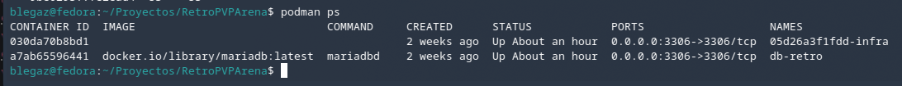
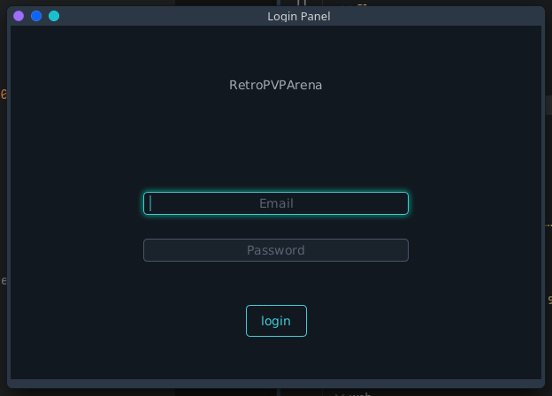
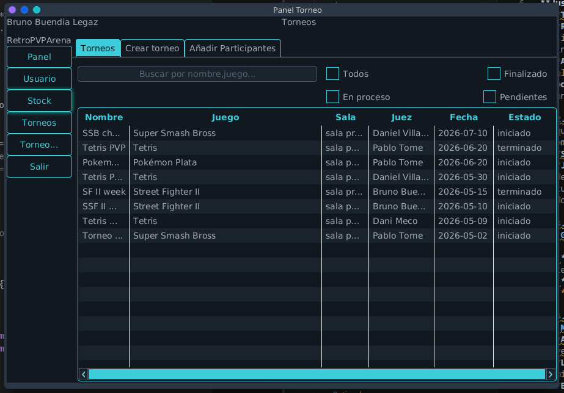
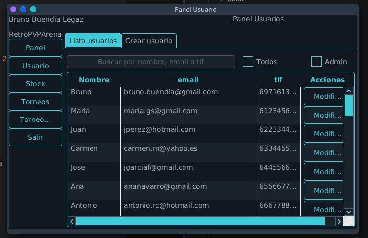
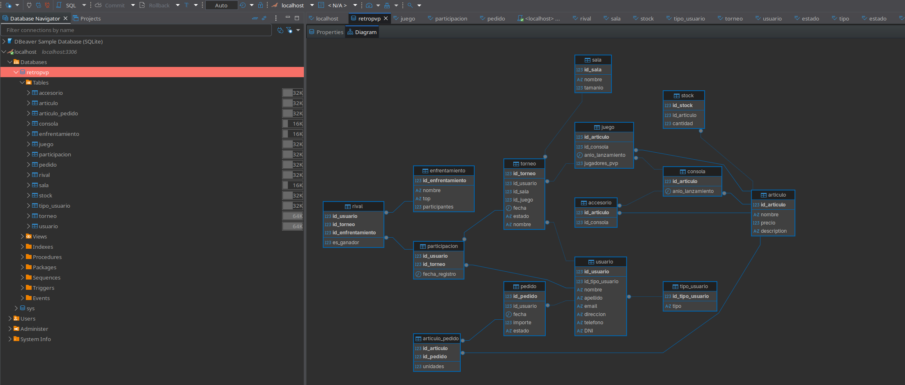

# Informe Técnico de Entorno de Ejecución - RetroPVPArena

## 1. Definición y Justificación del Entorno
El sistema **RetroPVPArena** se define como una **Estación de Trabajo de Administración (PC de Usuario)** con servicios de backend containerizados.

**Justificación:**
* **Tipo de sistema:** PC de Usuario / Estación de Trabajo.
* **Razón:** La aplicación principal está desarrollada en **JavaFX**, lo que implica una interfaz gráfica de usuario (GUI) que debe ejecutarse en el equipo del administrador.
* **Arquitectura:** Se utiliza un modelo híbrido. Mientras la lógica de gestión es local, la persistencia de datos se apoya en un contenedor **MariaDB** mediante **Podman**, permitiendo aislar la base de datos del sistema operativo anfitrión y garantizando que el entorno de desarrollo sea idéntico al de despliegue.

## 2. Sistema Operativo Recomendado
Aunque la aplicación es multiplataforma gracias a la Java Virtual Machine (JVM), se recomienda:
* **Sistema Principal:** **Ubuntu 22.04 LTS o superior**.
* **Justificación:** El desarrollo nativo se ha realizado en Linux(Fedora/CachyOs), donde la gestión de contenedores Podman es más eficiente (sin necesidad de máquinas virtuales intermedias pesadas como en Windows/macOS). No obstante, es compatible con Windows 10/11 siempre que se disponga de WSL2 para Podman.

## 3. Usuarios, Permisos y Estructura
### Gestión de Usuarios:

1.  **Usuario de SO:** Se recomienda un usuario estándar con permisos de ejecución y pertenencia al grupo `video` (para aceleración gráfica) y acceso al socket de `podman`.
2.  **Usuario de BBDD:**
    * `root`: Solo para tareas de administración inicial vía DBeaver.

## 4. Mantenimiento y Protección
### Mantenimiento Básico:
* **Actualización de Dependencias:** Revisión trimestral del `pom.xml` (especialmente drivers JDBC y versiones de JavaFX).
* **Limpieza de Contenedores:** Ejecutar `podman system prune` mensualmente para eliminar imágenes huérfanas.
* **Backups:** Exportación semanal de la base de datos mediante `mysqldump`.

### Protección:
* **Aislamiento:** El contenedor de MariaDB no debe exponer el puerto 3306 a la red pública, solo a `localhost`.
* **Firewall (UFW):** Bloquear todo tráfico entrante excepto los puertos estrictamente necesarios si se trabajara en red local.

## 5. Evidencias de Funcionamiento
* **Evidencia A:** Captura de la terminal con `podman ps` 
    
    
* **Evidencia B:** Pantallazo de la aplicación JavaFX abierta y conectada.

    

    

    

* **Evidencia C:** Captura de DBeaver visualizando las tablas creadas 
    .